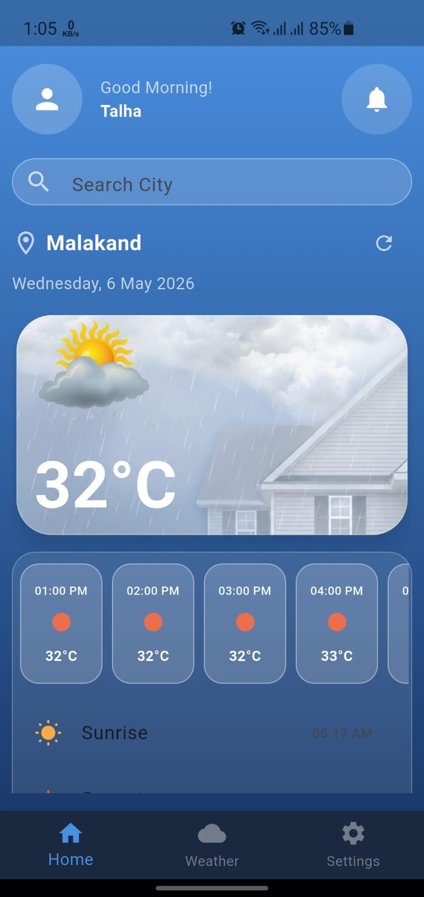
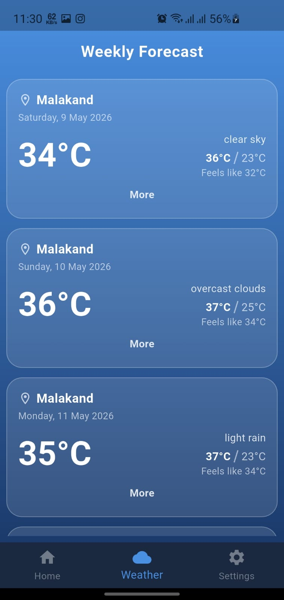
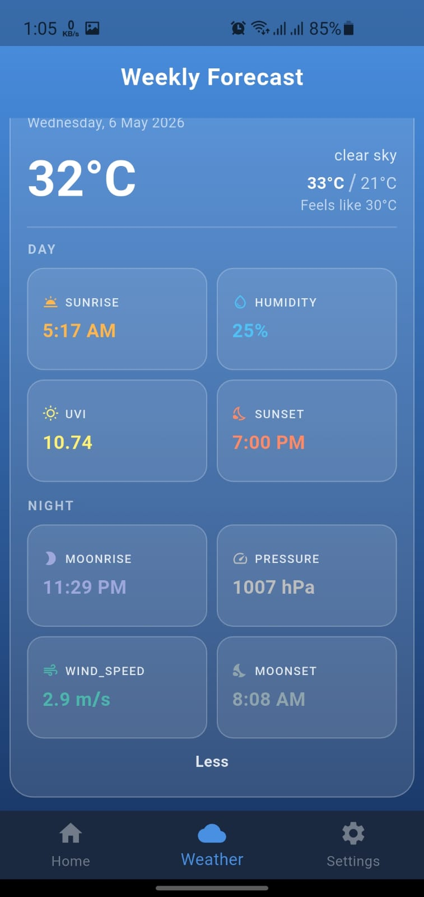
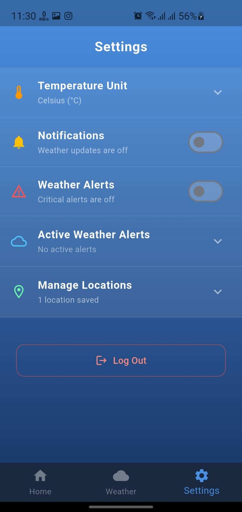

<div align="center">

# 🌤️ Weather Application

### A beautiful, feature-rich Flutter weather app with offline caching, live GPS, city search & smart notifications

[](https://flutter.dev)
[](https://dart.dev)
[](https://riverpod.dev)
[](https://pub.dev/packages/sqflite)
[](LICENSE)
[](https://android.com)

</div>

---

## 📸 Screenshots

<div align="center">

| Home Screen | Weekly Forecast | Forecast Expanded | Settings |
|:-----------:|:---------------:|:-----------------:|:--------:|
|  |  |  |  |

</div>

---

## 🌟 Overview

A production-grade Flutter weather app that delivers real-time weather data using the **OpenWeatherMap OneCall 3.0 API**. Built with a clean Riverpod state management architecture, it works seamlessly **online and offline** — showing cached data with a "last updated" timestamp when there's no internet connection.

The app is designed around real user needs: it asks for your name once (first launch only), remembers your saved cities, and lets you toggle between °C and °F across every screen instantly.

---

## ✨ Features

### 🌍 Location & Search
- **Live GPS** — auto-detects your location on launch with 3-attempt permission retry
- **City Search** — real-time dropdown suggestions as you type (powered by geocoding)
- **Manage Saved Locations** — save, view, and delete cities from the settings screen
- Saved cities load cached weather instantly, refresh from API when online

### 🌡️ Weather Data
- Current temperature, feels like, humidity, UV index, pressure, visibility
- **48-hour hourly forecast** with weather icons
- **7-day weekly forecast** with expandable daily detail cards
- Sunrise & sunset times, wind data, and weather alerts
- All data from **OpenWeatherMap OneCall 3.0**

### 📦 Offline Caching
- Full weather response cached locally using **SQLite** (sqflite)
- Opens with last known data when offline — no blank screens
- Orange **"Offline — Last updated: X min ago"** banner shown automatically
- Cache auto-updates silently when internet is restored

### 🌡️ Temperature Unit Toggle
- Switch between **°C and °F** from Settings — no API re-fetch needed
- Uses a centralized `TempConverter` utility — consistent across all screens
- Toggle persists in state and updates every temperature display instantly

### 🔔 Smart Notifications
- Weather update notification with current city + temperature
- Weather alerts notification when active alerts are present in API response
- Toggle notifications and alerts independently from Settings
- Uses `flutter_local_notifications`

### 👤 First-Launch Welcome
- Name screen shown only once — stored in SQLite `users` table
- Subsequent launches skip straight to the home screen
- Your name displayed throughout the app

---

## 🛠️ Tech Stack

| Package | Version | Purpose |
|---------|---------|---------|
| `flutter_riverpod` | ^2.x | State management (StateNotifier) |
| `sqflite` + `path` | ^2.3.3 | SQLite offline caching & user data |
| `connectivity_plus` | ^6.0.3 | Internet connection detection |
| `geolocator` + `geolocator_android` | ^13.x | Live GPS location |
| `geocoding` | ^3.x | City name ↔ coordinates conversion |
| `http` | ^1.x | OpenWeatherMap API calls |
| `flutter_local_notifications` | ^17.x | Push notifications |
| `flutter_dotenv` | ^5.x | API key management via `.env` |
| `intl` | ^0.19 | Date & time formatting |

---

## 🗄️ Database Schema

```
users           → id, name                           (1 row max — first launch only)
locations       → id, city_name, lat, lon, is_current (GPS + saved cities)
weather_cache   → id, location_id, json_data, last_updated
```

---

## 📁 Project Structure

```
lib/
├── core/
│   └── utils/
│       └── temp_converter.dart       # Kelvin → °C/°F conversion
├── database/
│   └── db_helper.dart                # All SQLite logic (singleton)
├── models/
│   └── weather_model.dart            # App state model
├── providers/
│   ├── weather_provider.dart         # StateNotifier — GPS, API, cache, search
│   └── icons_colors_provider.dart    # Weather condition → icon/color mapping
├── screens/
│   ├── welcome_screen.dart           # First-launch name entry
│   ├── main_screen.dart              # Bottom navigation host
│   ├── home_screen.dart              # Current weather + search
│   ├── weather_screen.dart           # Weekly forecast
│   └── setting_screen.dart           # Preferences, locations, notifications
└── widgets/
    ├── hours_card_widget.dart
    ├── weekly_weather_card_widget.dart
    ├── today_weather_detail_widget.dart
    └── ten_days_weather_detail_widget.dart
```

---

## 🚀 Getting Started

### Prerequisites
- Flutter SDK 3.x
- Android device (notifications unreliable on emulator)
- OpenWeatherMap API key (OneCall 3.0)

### 1. Clone the repo
```bash
git clone https://github.com/talhaarif326/weather_application.git
cd weather_application
```

### 2. Create `.env` file in project root
```env
apiKey=your_openweathermap_api_key_here
```

### 3. Add notification permission (Android 13+)

In `android/app/src/main/AndroidManifest.xml`:
```xml
<uses-permission android:name="android.permission.POST_NOTIFICATIONS"/>
```

### 4. Enable core library desugaring

In `android/app/build.gradle`:
```kotlin
compileOptions {
    isCoreLibraryDesugaringEnabled = true
    sourceCompatibility = JavaVersion.VERSION_17
    targetCompatibility = JavaVersion.VERSION_17
}

dependencies {
    coreLibraryDesugaring("com.android.tools:desugar_jdk_libs:2.1.4")
}
```

### 5. Install & run
```bash
flutter pub get
flutter run
```

---

## 🔄 Data Flow

```
App Launch
└── Check SQLite users table
    ├── Name exists  → MainScreen (home)
    └── No name      → WelcomeScreen → save name → MainScreen

fetchWeather()
└── Check internet
    ├── Offline → load SQLite cache → show offline banner
    └── Online  → GPS location → OpenWeatherMap API
                   → cache response in SQLite
                   → update all screens via Riverpod state
```

---

## 🤝 Contributing

1. Fork the repo
2. Create a branch: `git checkout -b feat/your-feature`
3. Commit your changes: `git commit -m "feat: add your feature"`
4. Push and open a PR

---

## 📄 License

This project is licensed under the **MIT License** — see [LICENSE](LICENSE) for details.

---

<div align="center">

Built with ❤️ using Flutter & OpenWeatherMap

⭐ Star this repo if you found it useful!

</div>
